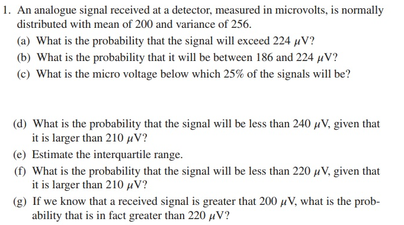
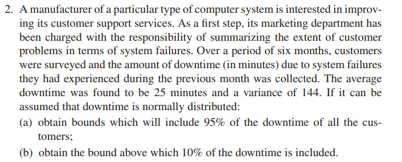

```` {r echo = FALSE}
mean1 <- 200
var1 <- 256

prob224 <- 1 - pnorm(224, mean1, sqrt(var1))

prob224to186 <- pnorm(224, mean1, sqrt(var1)) - pnorm(186, mean1, sqrt(var1))

percentile25 <- qnorm(0.25, mean1, sqrt(var1))

prob240to210 <- pnorm(240, mean1, sqrt(var1)) - pnorm(210, mean1, sqrt(var1))

interquartile <- qnorm(c(0.25,0.75), mean1, sqrt(var1))

prob220to210 <- pnorm(220, mean1, sqrt(var1)) - pnorm(210, mean1, sqrt(var1))

probgreater200then220 <- (1 - pnorm(200, mean1, sqrt(var1))) - (1 - pnorm(220, mean1, sqrt(var1)))
````
<br>
Letter A Answer:
```` {r echo = TRUE}
print(prob224)
cat("It has a " ,  round(prob224*100,2), "% probability that the signal will exceed 224 microvolts")
````
<br>
Letter B Answer:
```` {r echo = TRUE}
print(pnorm(224, mean1, sqrt(var1)))
print(pnorm(186, mean1, sqrt(var1)))
print(prob224to186)
cat("It has a " ,  round(prob224to186*100,2), "% probability that the signal will be between 186 to 224 microvolts")
````
<br>
Letter C Answer:
```` {r echo = TRUE}
print(percentile25)
cat("The micro voltage below 25% percentile is", percentile25)
````
<br>
Letter D Answer:
```` {r echo = TRUE}
print(pnorm(240, mean1, sqrt(var1)))
print(pnorm(210, mean1, sqrt(var1)))
print(prob240to210)
cat("It has a " ,  round(prob240to210*100,2), "% probability that the signal will be less than 240 but greater than 210 microvolts")
````
<br>
Letter E Answer:
```` {r echo = TRUE}
print(interquartile)
cat("The interquartile Range is:", interquartile[2]-interquartile[1])
````
<br>
Letter F Answer:
```` {r echo = TRUE}
print(pnorm(220, mean1, sqrt(var1)))
print(pnorm(210, mean1, sqrt(var1)))
print(prob220to210)
cat("It has a " ,  round(prob220to210*100,2), "% probability that the signal will be less than 220 but greater than 210 microvolts")
````
<br>
Letter G Answer:
```` {r echo = TRUE}
print(1 - pnorm(200, mean1, sqrt(var1)))
print(1 - pnorm(220, mean1, sqrt(var1)))
print(probgreater200then220)
cat("It has a " ,  round(probgreater200then220*100,2), "% probability that the signal will be greater than 200 microvolts but also be greater than 220 microvolts already")
````

<br>
Letter G Answer:
```` {r echo = TRUE}
# Given parameters
mean_downtime <- 25
variance_downtime <- 144

# (a) Obtain bounds which will include 95% of the downtime of all the customers
lower_bound_95 <- qnorm(0.025, mean_downtime, sqrt(variance_downtime))
upper_bound_95 <- qnorm(0.975, mean_downtime, sqrt(variance_downtime))

# (b) Obtain the bound above which 10% of the downtime is included
bound_above_10 <- qnorm(0.90, mean_downtime, sqrt(variance_downtime))

# Output the results
print(paste("Bounds including 95% of downtime:", round(lower_bound_95, 2), "to", round(upper_bound_95, 2)))
print(paste("Bound above which 10% of downtime is included:", round(bound_above_10, 2)))
````
